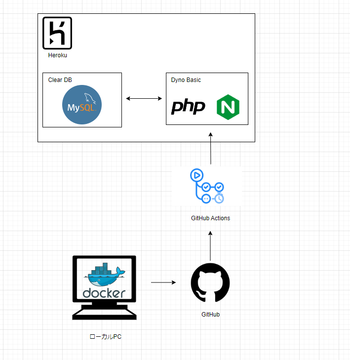
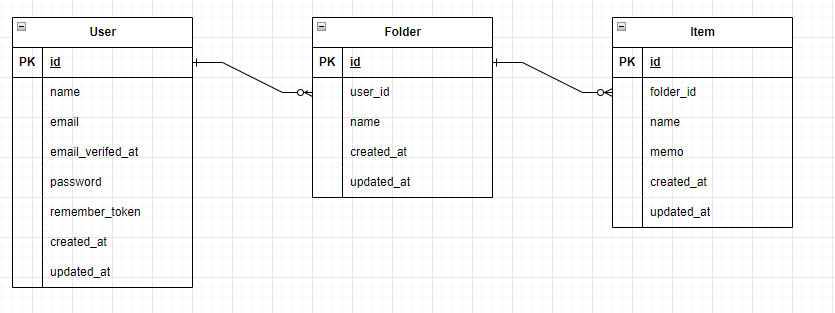

# AniMane

アプリへのリンク: <https://animane-prot.net>

## 概要

アニメを構造的に管理できるアプリ。  
自分の好きなフォルダを作成し各フォルダごとにアニメを管理できる。  
使いやすさを重要視するため、シンプルな操作と見た目となるように心がけた。

## 作成の経緯

アニメの管理を行う際にメモアプリを使用しているが管理するアニメの数が増えると管理のしづらさを感じるようになった。特に、メモアプリだけでは、「構造的に管理すること」と「並び替え」を行うことができない。
この解決策として、 アニメ視聴管理アプリなどの使用が挙げられるが、 「登録されているアニメに制限があること」と「構造的に管理できる機能に制限がある(
フォルダ構造がサービスによってすでに決まっている)」ため満足のいく使用要件を満たせない。 そこで、自分の好きなフォルダを作成し各フォルダごとにアニメを管理できるアプリを作成しようと考えた。

## 機能一覧

- ユーザの登録・管理ができる
- アニメの登録・管理ができる
    - アニメの作成ができる
      - タイトルの作成ができる
      - メモの作成ができる
    - アニメの削除ができる
    - アニメの変更ができる
      - タイトルの変更ができる
      - メモの変更ができる
    - フォルダに属するアニメの一覧を閲覧できる(無限スクロール)
    - アニメのタイトル順に並べ替えられる
    - アニメの作成順に並べ替えられる
    - アニメの最新順に並べ替えられる
    - アニメの詳細が閲覧できる
      - アニメのタイトルが閲覧できる
      - アニメのメモが閲覧できる
      - アニメに関連する動画が閲覧できる
- フォルダ内検索ができる
- フォルダの登録・管理機能
    - フォルダの作成ができる
    - フォルダの削除ができる
    - フォルダの変更ができる
    - フォルダの一覧を閲覧できる
    - フォルダの検索ができる
- 通知機能
    - API通信の成功・失敗の通知

## 使用技術

##### フロントエンド

- React 17.0.2

##### バックエンド

- PHP 8.0.19
- Laravel 8.83.11

##### ミドルウェア・サーバー

- MySQL 8.0.29
- Nginx 1.20.2

##### その他

- Docker/Docker compose
- Heroku
- GitHub Actions

## 設計

### インフラ構成図

### ER図

### URL設計

###### 画面URL

| URL                                       | Description          |
|-------------------------------------------|----------------------|
| /app/home                                 | ホーム画面                |
| /app/home/folders/:folderId/items         | 選択されたフォルダのアイテム一覧表示画面 |
| /app/home/folders/:folderId/items/:itemId | アニメ詳細画面              |

###### API

| URL                                | Method | Description           |
|------------------------------------|--------|-----------------------|
| /api/folders                       | GET    | フォルダ一覧を取得             |
| /api/folders                       | POST   | 新しいフォルダの作成            |
| /api/folders/{folder}              | PUT    | フォルダの更新               |
| /api/folders/{folder}              | DELETE | フォルダの削除               |
| /api/folders/{folder}/items        | GET    | 選択されたフォルダに関連するアイテムの取得 |
| /api/folders/{folder}/items/search | GET    | フォルダ内検索               |
| /api/folders/{folder}/items        | POST   | 新しいアイテムの作成            |
| /api/folders/{folder}/items/{item} | GET    | アイテムの取得               |
| /api/folders/{folder}/items/{item} | PUT    | アイテムの更新               |
| /api/folders/{folder}/items/{item} | DELETE | アイテムの削除               |

## 今後

- フロントエンドとバックエンドを切り分けたアーキテクチャでの開発をやってみたい。
- GithubActionsでCI/CDの自動化